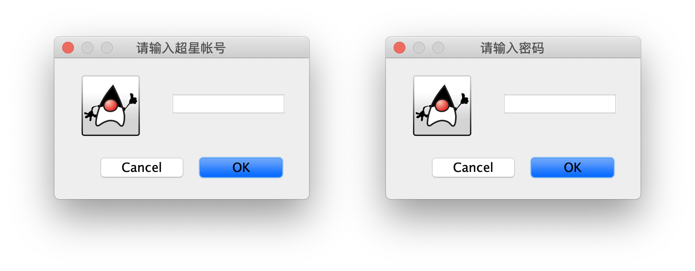
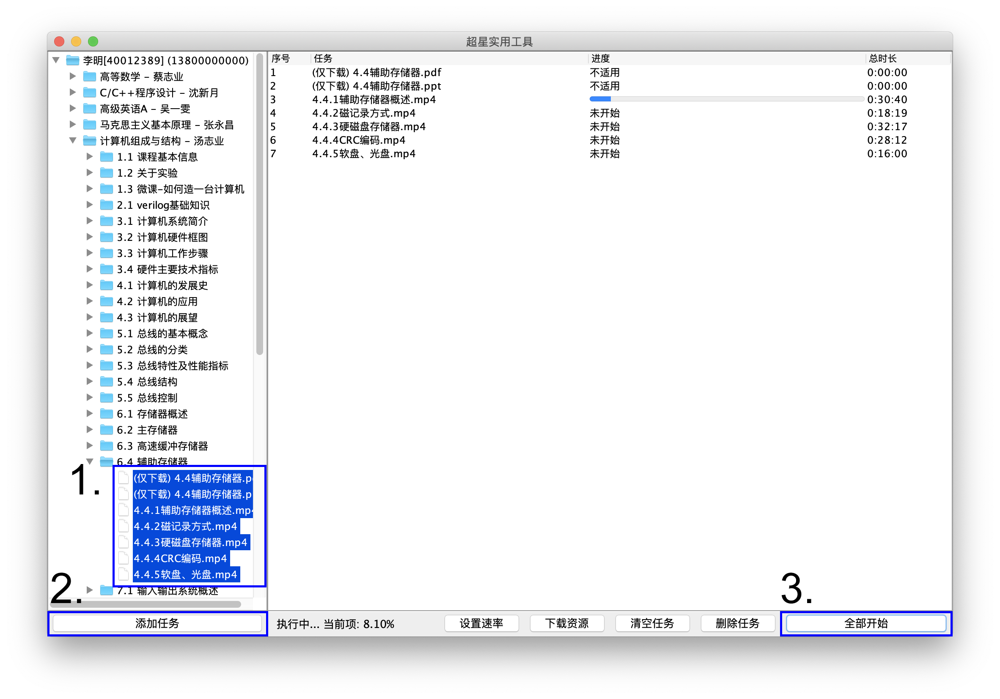
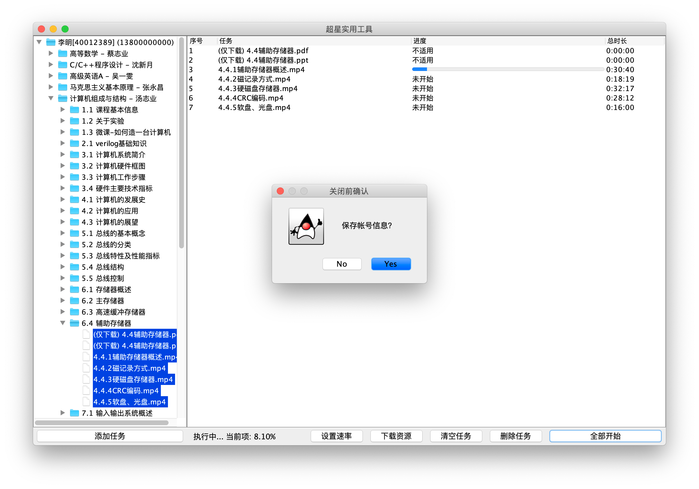

# ChxUtility 超星实用工具

**仅供学习研究使用。**
该Java工具通过模拟超星学习通手机客户端，可实现资源时长挂机、下载浏览。

## 使用说明

### 1. 下载安装

类别                  | 下载链接
-------------------- | --------------------
Windows 客户端（msi）  | [ChxGUI-1.0.msi](https://github.com/MikeWang000000/ChxUtility/releases/download/1.0/ChxGUI-1.0.msi)
macOS 客户端（dmg）    | [ChxGUI-1.0.dmg](https://github.com/MikeWang000000/ChxUtility/releases/download/1.0/ChxGUI-1.0.dmg)
Jar 跨平台（Java 11+） | [ChxGUI-1.0.jar](https://github.com/MikeWang000000/ChxUtility/releases/download/1.0/ChxGUI-1.0.jar)

> *注：macOS中如有提示：`“xxx”已损坏，打不开。`，应先在终端执行`sudo spctl --master-disable`临时关闭签名验证。*

### 2. 登录帐号

第一次运行程序，会弹出登录框。请输入正确的用户名密码，即可进入主页面。

### 3. 主界面

左侧目录边栏展示课程信息。您可以展开目录，选择需要完成的任务，点击`添加任务`按钮。

当然，您也可以按住`Ctrl/⌘`键多选，或使用`Ctrl/⌘` + `A`组合键全选，再点击`添加任务`按钮批量添加。

右侧表格为已添加的任务。选中单个任务，点击`下载资源`可以下载您想要保存的资源。点击`全部开始`按钮即开始挂机工作。

### 4. 退出程序

退出程序前，程序会询问您是否保留帐号信息。如选择保留，那么下次将自动登录，否则您需再次输入帐号密码。

## 源代码

### 集成开发环境

Eclipse IDE for Java Developers 2020

### 第三方库
Gson 2.8.6

### JDK 版本
OpenJDK 11 或以上

## 开源许可协议

本项目使用 GPLv3 开源许可协议。